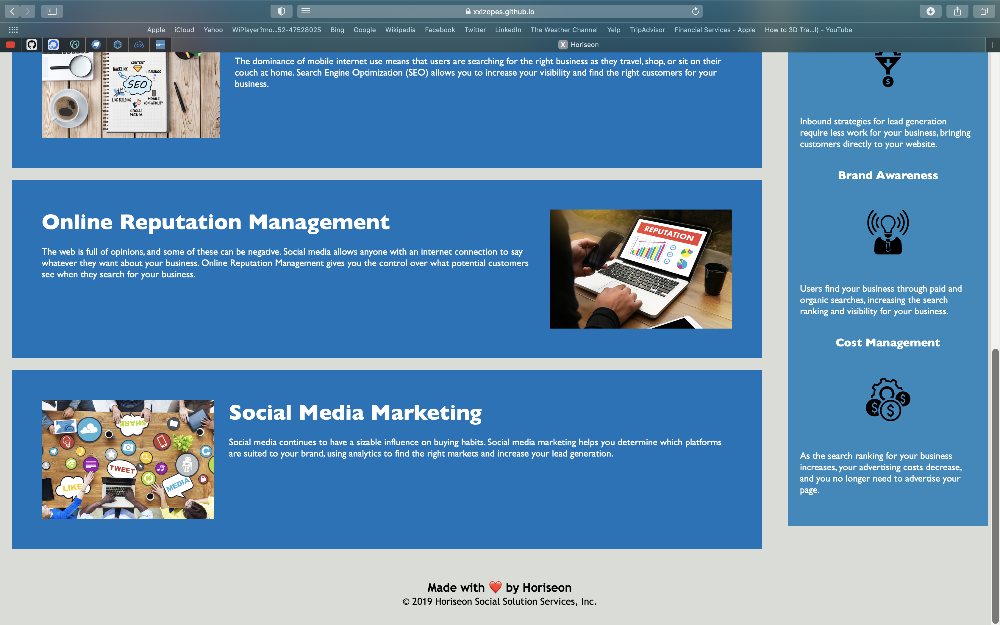

# Horiseon Landing Page Code Refractor

## Acceptance Criteria
1. Update to accessibility standards
2. Add semantic HTML elements
3. Made sure HTML was structured to follow a logical and natural flow independant of styling
4. Added ault attributes to images for screen readers
5. Made sure heading attributes fell in sequential order
6. Added a concise, descriptive title

https://xxlzopes.github.io/Horiseon/

